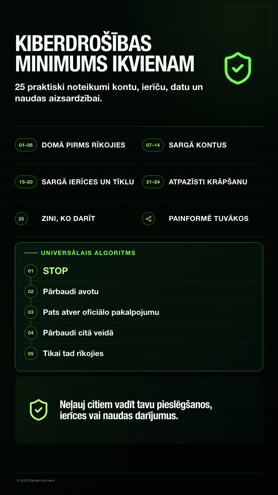
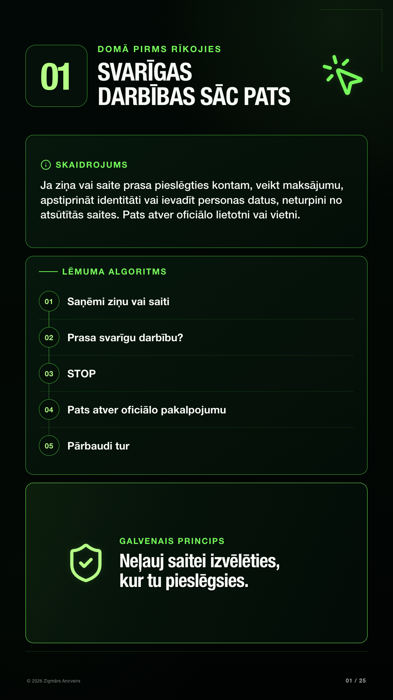
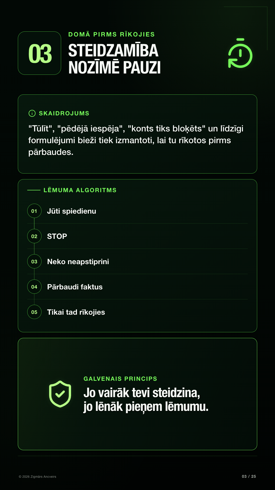
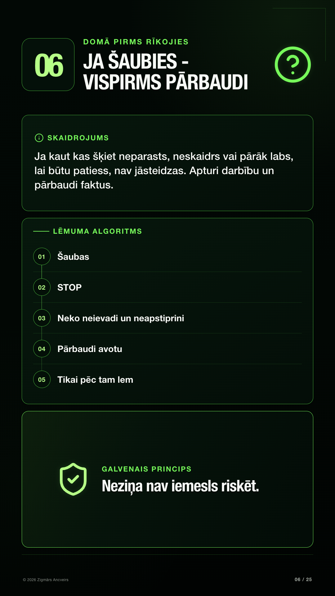
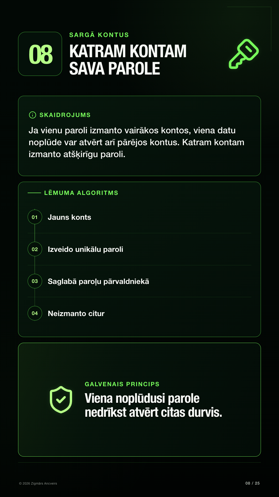
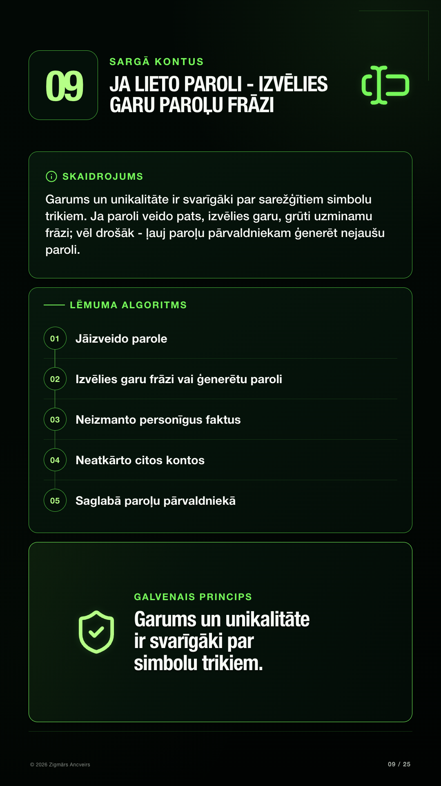
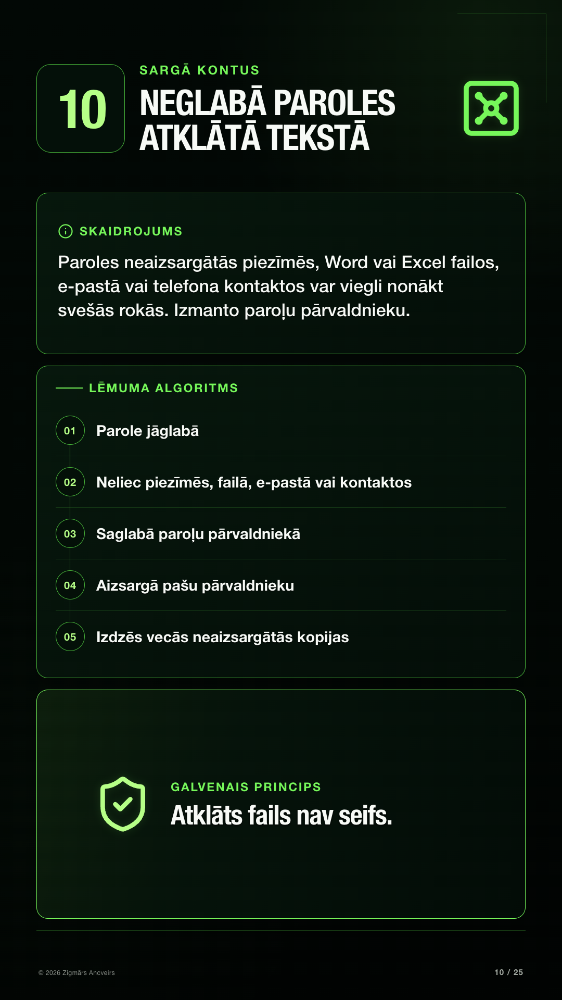
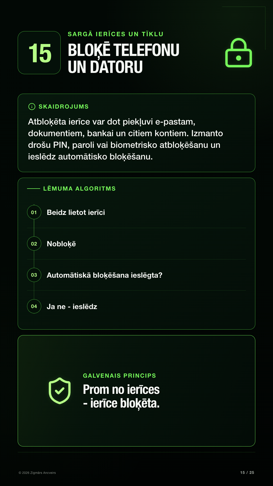
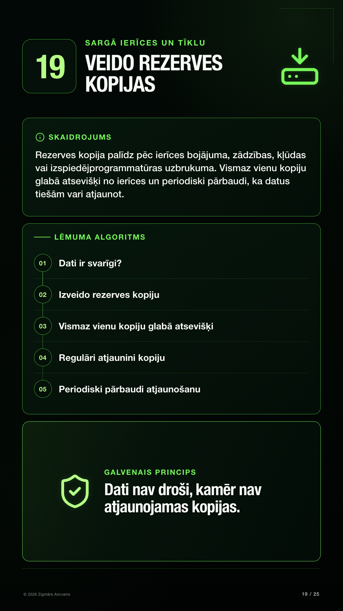

# Kiberdrošības minimums ikvienam

  

**25 praktiski noteikumi kontu, ierīču, datu un naudas aizsardzībai.**

Praktisks kiberdrošības minimums ikdienai - vienkārši rīcības principi, kas palīdz aizsargāt kontus, ierīces, datus un naudu, atpazīt krāpšanu un zināt, ko darīt incidenta gadījumā.

Materiāla mērķis nav mācīt analizēt katru iespējamo uzbrukuma paņēmienu. Mērķis ir dot atkārtojamus drošības principus, kurus iespējams izmantot arī tad, ja konkrētā krāpšanas vai uzbrukuma metode nav pazīstama.

> **Universālais princips:** Neļauj citiem vadīt tavu pieslēgšanos, ierīces vai naudas darījumus.

## PDF

**[Lejupielādēt pilno PDF - "Kiberdrošības minimums ikvienam"](./downloads/kiberdrosibas-minimums-ikvienam.pdf)**

---

## 01-06 · Domā pirms rīkojies

### 01 · Svarīgas darbības sāc pats

### 02 · Pirms maksājuma pārbaudi saņēmēju

### 03 · Steidzamība nozīmē pauzi

### 04 · Aizdomīgu pieprasījumu pārbaudi citā veidā

### 05 · Ziņa nepierāda, kas to sūtījis

### 06 · Ja šaubies - vispirms pārbaudi

---

## 07-14 · Sargā kontus

### 07 · Nekad nevienam nesūti paroles, PIN vai vienreizējos kodus

### 08 · Katram kontam sava parole

### 09 · Ja lieto paroli - izvēlies garu paroļu frāzi

### 10 · Neglabā paroles atklātā tekstā

### 11 · Ieslēdz Passkey vai divu soļu apstiprināšanu

### 12 · Īpaši sargā galveno e-pastu

### 13 · Pārskati svarīgo kontu drošības iestatījumus

### 14 · Atvieno vecās ierīces un nevajadzīgas piekļuves

---

## 15-20 · Sargā ierīces un tīklu

### 15 · Bloķē telefonu un datoru

### 16 · Regulāri atjaunini ierīces un programmas

### 17 · Pārbaudi, vai ierīces aizsardzība ir ieslēgta

### 18 · Sargā mājas Wi-Fi un rūteri

### 19 · Veido rezerves kopijas

### 20 · Papildini aizsardzību ar CERT.LV/NIC.LV DNS ugunsmūri

---

## 21-24 · Atpazīsti krāpšanu

### 21 · Neatver negaidītus vai aizdomīgus pielikumus un QR kodus

### 22 · Neinstalē programmas pēc sveša cilvēka norādes

### 23 · Glīts dizains nepierāda uzticamību

### 24 · Sargies no pārāk labiem piedāvājumiem un emocionāliem stāstiem

---

## 25 · Zini, ko darīt

### 25 · Ziņo un rīkojies uzreiz

---

## Universālais algoritms

1. **STOP**
2. **Pārbaudi avotu**
3. **Pats atver oficiālo pakalpojumu**
4. **Pārbaudi citā veidā**
5. **Tikai tad rīkojies**

> **Neļauj citiem vadīt tavu pieslēgšanos, ierīces vai naudas darījumus.**

## Par materiālu

"Kiberdrošības minimums ikvienam" ir praktisks sabiedrības kiberdrošības materiāls. Tas koncentrējas uz četrām ikdienas riska zonām:

- sociālo inženieriju un drošu lēmumu pieņemšanu;
- kontu un autentifikācijas drošību;
- ierīču, tīkla un datu aizsardzību;
- krāpšanas atpazīšanu un rīcību incidenta gadījumā.

Materiāls ir latviešu valodā un paredzēts personīgās kiberdrošības un sabiedrības kiberdrošības pratības veicināšanai.

## Autors

**Zigmārs Ancveirs**

Technology Leader · Software Engineer · Cybersecurity & Ethical Hacking  
FinTech · RegTech · CivTech · Cloud · Data · AI

© 2026 Zigmārs Ancveirs
